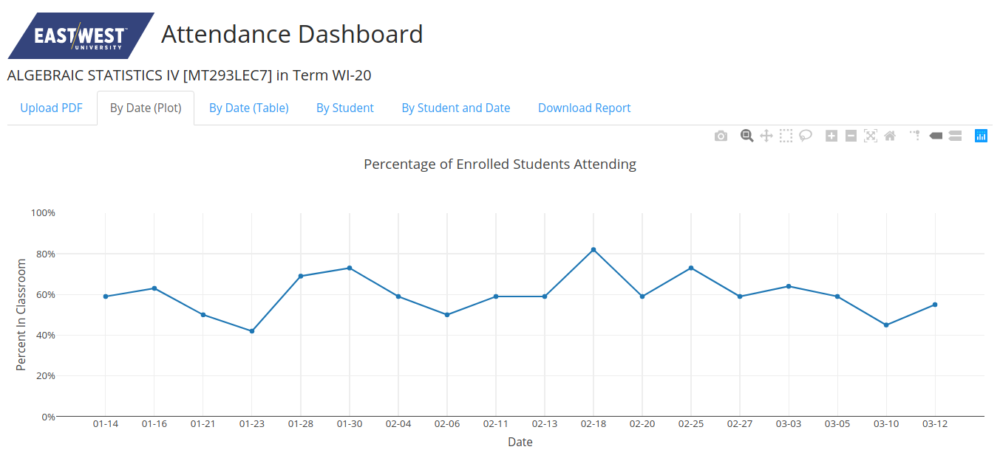
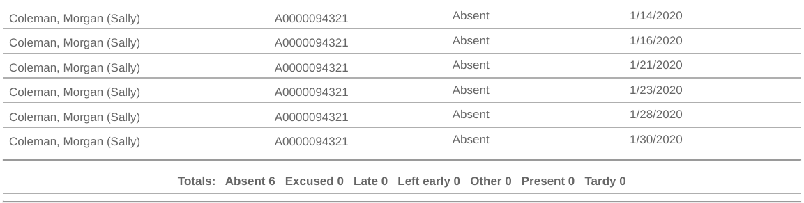

# East-West University Student Attendance Dashboard

## Overview

East-West University's management system, CAMS, houses student attendance data.  This web app is a Shiny app, written in R, which builds a dashboard of descriptive plots and tables based on CAMS attendance data.

## The Dashboard

The user, typically an East-West University faculty member, navigates the dashboard by choosing from the tabs along the top of the page.  The tabs offer the following views:

* Upload PDF - Where the user uploads attendance downloaded from CAMS in PDF format.
* By Date (Plot) - Shows a plot of attendance data over the duration of the class
* By Date (Table) - Shows a table of attendance data over the duration of the class
* By Student - Shows a table of how may times each student as present or absent.
* By Student and Date - Shows a table of whether a student was present or absent on each class meeting date.

## Raw Data

The above mock data shows a sample of the arrangement of student attendance data in the CAMS PDF report.  It features some totals, and is already fairly tidy, but needs parsing to show useful summary information.